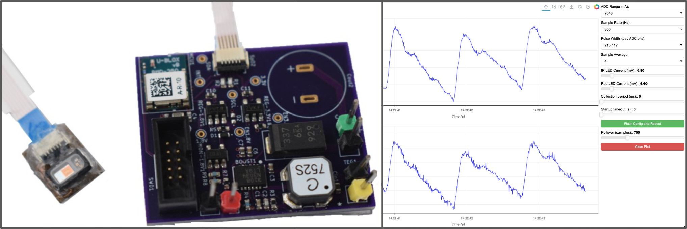

# TEGSense Firmware

[TEGSense](https://github.com/TEGSense/hardware) is a battery-free photoplethysmograph (PPG) device powered by an array of thermoelectric generators (TEGs).
It is based around three primary pieces of hardware:

- [LTC3108](https://www.analog.com/en/products/ltc3108.html) "Ultralow Voltage Step-Up Converter and Power Manager" to use the low voltage output of the TEGs to charge a capacitor array;
- [MAX30101](https://www.analog.com/en/products/max30101.html) "High-Sensitivity Pulse Oximeter and Heart-Rate Sensor for Wearable Health" to collect red and infrared (IR) photoplethysmographs (PPGs) from the finger for heart rate and SpO2 biometric monitoring;
- [BMD-350](https://www.u-blox.com/en/product/bmd-3035-series-open-cpu) "Stand-alone Bluetooth 5.0 low energy module" (based on the [Nordic nRF52832](https://www.nordicsemi.com/products/nrf52832) ARM processor) for low power device operation and Bluetooth Low Energy (BLE) data telemetry.

This repository hosts the firmware for that board, and also provides a baseline implementation for general use of the [PPGView](https://github.com/TEGSense/ppgview) software for real-time PPG capture and MAX30101 device configuration.

## Features

- Based on the open-source real-time operating system (RTOS) [Zephyr](https://www.zephyrproject.org/) and the [Nordic Connect SDK (NCS)](https://www.nordicsemi.com/Products/Development-software/nrf-connect-sdk).
- Red and infrared (IR) PPG waveform capture.
- Device configuration options for ADC scaling, sample rate, pulse width, device averaging, and LED currents.
- Single-shot or continuous measurement options.
- Startup measurement delay.
- Sensor settings stored to flash.
- Real-time plotting with zooming, scrolling, and figure saving (via [PPGView](https://github.com/TEGSense/ppgview))
- Input and output data capture (via [PPGView](https://github.com/TEGSense/ppgview)).
- Wireless BLE interface.
- Efficient, low-power operation.

## Use

The recommended way to use the software is through the [nRF Connect tools for VS Code](https://www.nordicsemi.com/Products/Development-tools/nRF-Connect-for-VS-Code), but as it's based on Zephyr RTOS there are many ways to go about it.
Using Visual Studio Code, you can simply add a build configuration with the intended target board and start the build.
The target board could be the [TEGSense](https://github.com/TEGSense/hardware) device, for which a board configuration is included.
The u-blox BMD-300 (based on the nRF52832) will also work.
Other boards, like the nRF52-DK will work as well, but they may not have the built-in support for the on-board DC-DC converter, so you will either have to add the necessary external LC filter or fall back on the LDO operation.

Once flashed to the target device, the application runs in either a continuous data collection mode, or a single-shot short collection period at startup.
For general purposes, this single-shot startup may not be useful.
The TEGSense device uses a hysteretic switch to disable the regulators powering the sensor and microcontroller to turn off the device after collection, and turn it back on when the capacitors are charged.
Newer TEGSense hardware will have voltage monitoring built in to run single-shot collections more efficiently than having to burn through the capacitor charge to shut off the device, but that is not implemented at the moment.
Once shut off, the device idles, maintaining the BLE connection and sending periodic idle messages while waiting for commands (e.g., reconfigurations or reboots).

## MAX30101 Firmware

Zephyr ships with drivers for MAX3010x devices, but it's extremely limited.
The driver in this repository started incorporating features into Zephyr's sensor framework, but that framework is cumbersom and inefficient to deal with.
For that reason, a fork of the [Sparkfun MAX3010x sensor library](https://github.com/sparkfun/SparkFun_MAX3010x_Sensor_Library) is included for use instead.

## License

[MIT license](LICENSE)

## Author

This software was developed by Anthony Wertz.
